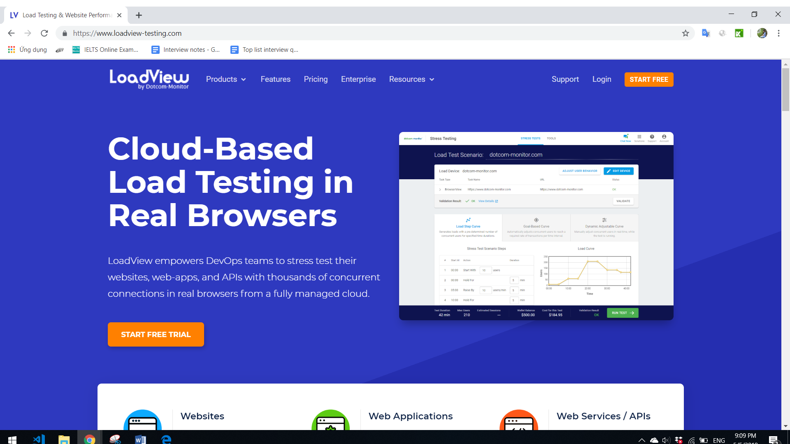
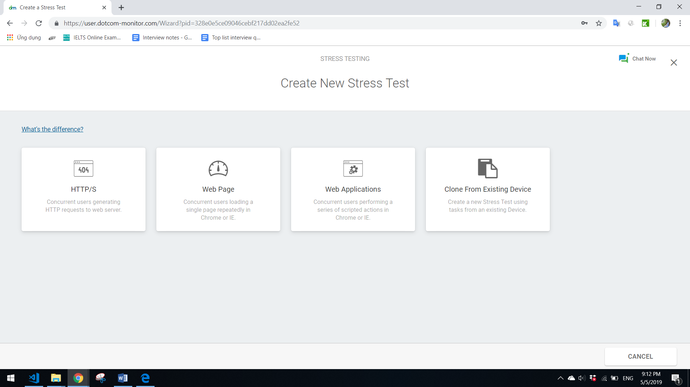
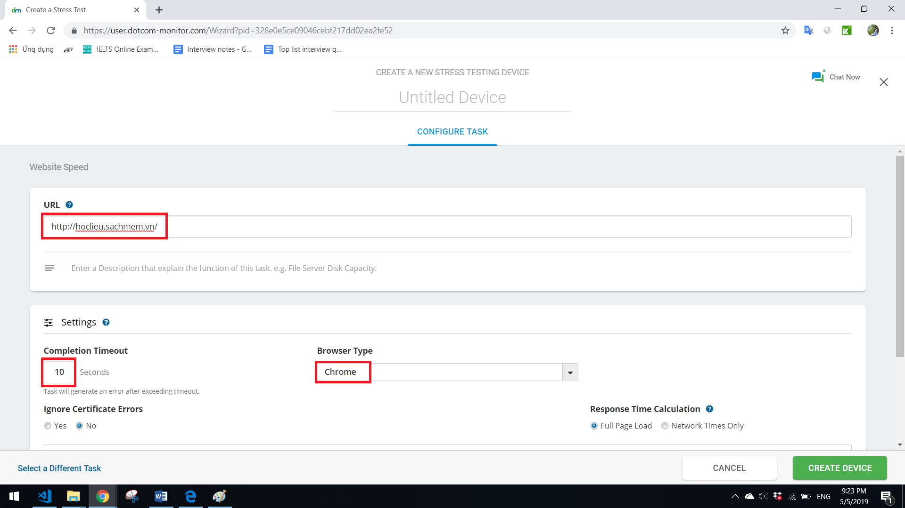
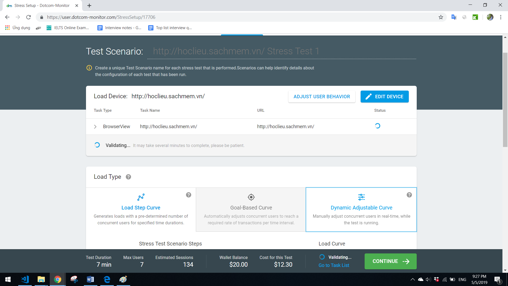
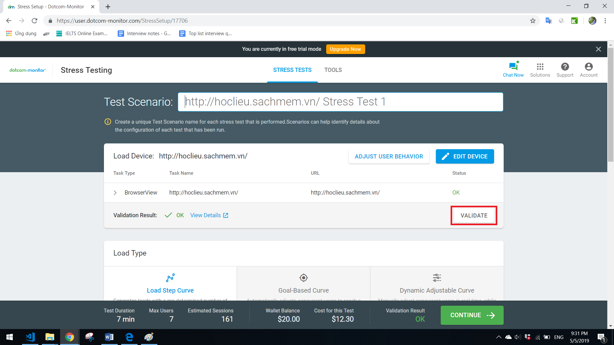
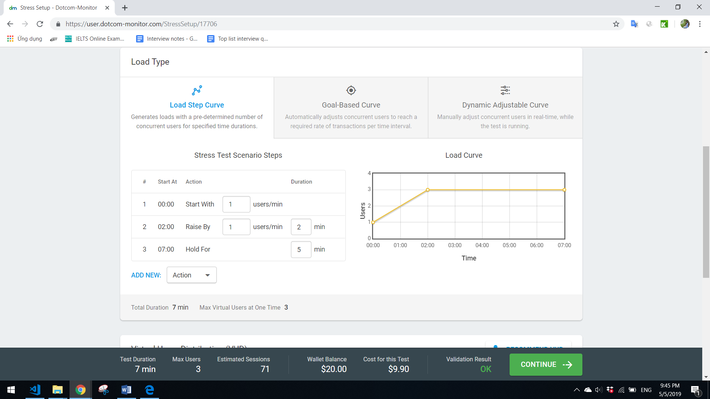
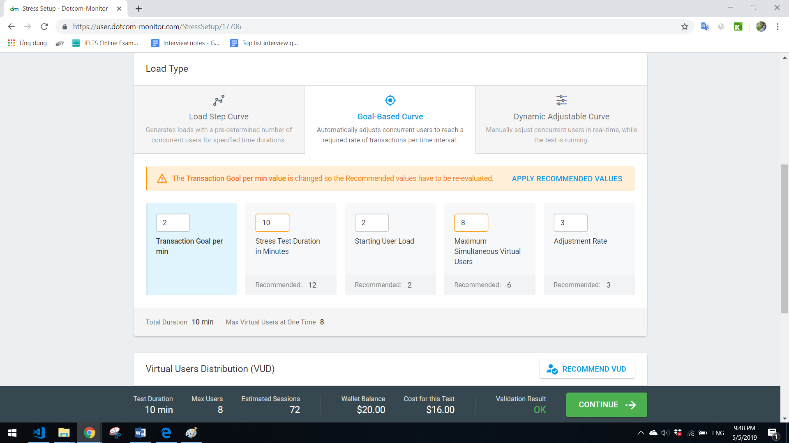
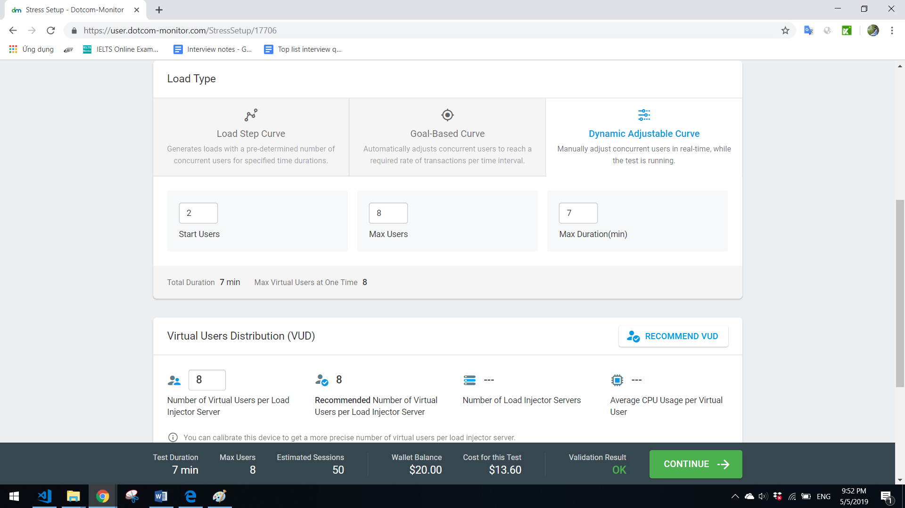
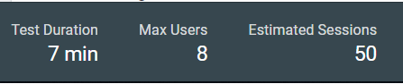

# Tìm hiểu công cụ kiểm thử Performance LoadView cho trang hoclieu.sachmem.com

## Nhóm bài tập: Nhóm 2

## 1. LoadView là gì?
### Định nghĩa:
LoadView là một platform để thực hiện các bài "stress test" giúp dự đoán một website sẽ phản hồi thế nào với lượng truy cập các nhau.

LoadView có thể trả lời các câu hỏi như:  
- Số lượng người dùng là bao nhiều sẽ làm ảnh hưởng đến hiệu suất của website
- Website có thể xử lý/phục vụ đồng thời bao nhiêu người dùng
- Chỗ nào trong web application có thất cổ chai
- Đâu là breaking point trên website, khi nào thì sử dụng quá nguồn tài nguyên
### Cơ chế hoạt động:
Dotcom-Monitor cung cấp các dịch vụ kiểm tra tải trang web tự quản lý theo yêu cầu bên ngoài, được cài đặt và chạy trong vòng vài phút sử dụng một thanh điều khiển online. Dịch vụ trên không yêu cầu phải cung cấp bất kì cơ cấu hạ tầng về cả phần cứng và phần mềm. Các tải được mô phỏng từ nhiều địa điểm trên toàn thế giới. Để kiểm thử chính website đó, LoadView sẽ kiểm thử cơ sở hạ tầng internet bao gồm kết nối, router, tường lửa, bộ chuyển và bất cứ thứ gì khác có thể liên quan đến website đó, hoặc ảnh hưởng đến mạng lướt của website.  

Cách tiếp cận từ ngoài vào được học hỏi từ hành vi tự nhiên của các người dùng thực khi truy cập vào website bằng internet. Do vậy, nó cung cấp những hiểu biết chính xác hơn về các vấn đều hiệu suất mà người dùng trang web có thể gặp phải. 

### LoadView hoạt động như thế nào?
Dotcom-Monitor sử dụng một mạng toàn cầu của Load Injector Server (LI) để tạo ra các người dùng truy cập website cần tiến hành stress testing. Như một admin, chúng ta cần thiết lập:
- Đối tượng cần kiểm thử
- Số người dùng ảo (người tải trang)
- Thời gian test 
- Các hành vi của người dùng cần mô tả 

Khi một stress test được thiết lập, ta có thể khời tạo stress test bất cứ lúc nào từ thanh điều khiểm (control panel) bằng việc sử dụng tài khoản Dotcom-Monitor của bạn. Khi một stress test hoàn thành, kết quả sẽ được cập nhật lên thanh điều khiển và bạn có thể sử dụng để phân tích, báo cáo.
## 2. Cách cài đặt và sử dụng
### Bước 1: Tạo tài khoản để bắt đầu
Truy cập vào đường link và ấn vào START FREE để tạo một tài khoản

### Bước 2: Chọn một dạng test cho trang hoclieu.sachmem.com
Sau khi tạo được tài khoản, cửa sổ để chọn kiểu stress test sẽ được mở ra

Có 4 lựa chọn có thể chọn:
- HTTP/S: các người dùng đồng thời tạo ra các HTTP request đến web server
- Web Page: các người dùng đồng thời load một trang web lặp đi lặp lại trên Chrome hoặc IE
- Web Application: các người dùng đồng thời thực hiện một chuỗi hành động trên Chrome hoặc IE
- Clone From Existing Device: Tạo ra một stress test dùng một task đã có trên thiết bị khác

Trong phần này, mình xác định số người dừng đồng thời truy cập trang hoclieu.sachmem.com, nên sẽ chọn Web Page

### Bước 3: Thiết lập các giá trị
Mình sẽ thiết lập một số giá trị bao gồm URL, Completion Timeout, Browser Type như hình dưới.

Cuối cùng ấn nút CREATE DEVICE ở góc dưới phải màn hình, một cửa sổ như hình bên dưới sẽ hiện lên:

### Bước 4: Chạy stress test
Để chạy chương trình chúng ta ấn nút VALIDATE như được bôi đỏ trong hình. Nếu muốn thay đổi thông số, ta cũng có thể ấn nút EDIT DEVICE.

### Chú ý:
Trong khi tải, có thể dùng 1 trong ba loại tải bên dưới:
- Load Step Curve: tạo ra các tải với một số lượng các người dùng đồng thời được xác định theo thời gian. Ta có thể thiết lập một số thông số như số lượng người dùng ban đầu, lượng tăng trong 1 phút, số lần tăng, thời gian chạy như hình bên dưới.

- Goal-Base Curve: tự độ điều chỉnh số người dùng đồng thời sử dụng để chạm tới require rate của số giao dịch trong một khoảng thời gian.

- Dynamic Adjustable Curve: điều chỉnh thủ công số người dùng đồng thời trong thời gian thực, trong khi bài kiểm thứ đang chạy.

Sau khi thay đổi thông số, chỉ cần ấn chuột ra khỏi text-box, chương trình sẽ tự động chạy lại.
## 3. Kết quả kiểm thử
Kết quả của bài kiểm thử được thể hiện ở thanh điều khiển ở góc dưới màn hình. Với ví dụ về test lượng người truy cập, thanh điều khiển có hiển thị thời gian kiểm tra, số lượng người dùng tối đa có thể đạt và số sessions ước lượng.  
